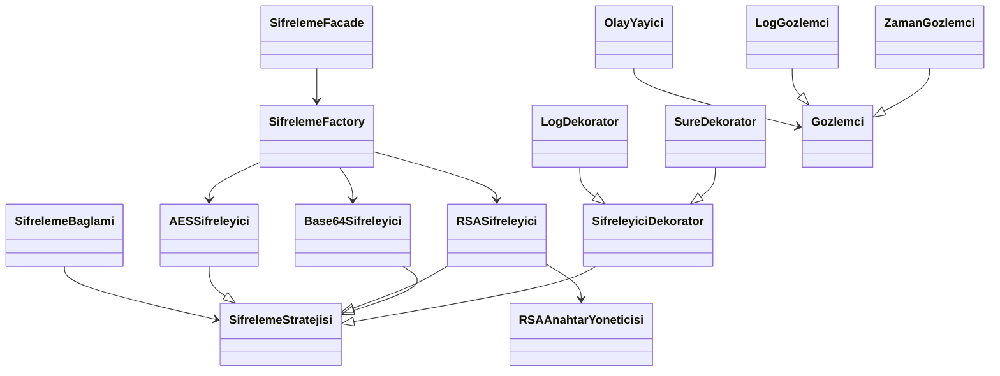

# design_patterns_2
Yazılım Tasarım Örüntüleri dersi vize ödevi.

# KONU SEÇİMİ: E - Şifreleme Aracı
Şifreleme aracı konusu, son zamanlarda kendi yaptığım projelerle de ilgili olabileceği düşüncesiyle ilgimi çekti. Farklı algoritmaları da araştırmış olurum diye düşündüm. Bu nedenlerle şifreleme aracı konusunu seçmeye karar verdim.

# Proje Ne Yapıyor?

Bu proje, farklı şifreleme algoritmalarını (AES, RSA, Base64) kullanarak metinleri şifreleyen ve çözen bir sistemdir.

Sistem, yalnızca şifreleme işlemi yapmakla kalmaz aynı zamanda Loglama, Süre ölçümü, Olay dinleme (observer), Algoritma değişimi (strategy), Nesne oluşturma yönetimi (factory) gibi genişletilebilir özellikler sunar. Amaç, yazılım tasarım örüntülerini gerçek bir problem üzerinde uygulayarak bakımı kolay, genişletilebilir ve esnek bir mimari oluşturmaktır.


# Kullanılan Tasarım Örüntüleri

## Creational Patterns
    Factory Method
    - Şifreleme algoritmalarını merkezi bir yapıdan oluşturur.
    - Yeni algoritma eklemeyi kolaylaştırır.

    Singleton
    - RSA anahtar yönetimini tek bir instance üzerinden yönetir.
    - Gereksiz anahtar üretimini engeller.

## Structural Patterns
    Facade
    - Sistemi basit bir arayüz üzerinden kullanılabilir hale getirir.
    - Factory ve Decorator karmaşıklığını gizler.

    Decorator
    - Şifreleme işlemlerine log ve süre ölçümü gibi özellikler ekler.
    - Mevcut kodu değiştirmeden yeni davranış eklemeyi sağlar.


## Behavioral Patterns
    Strategy
    - Şifreleme algoritmalarını birbirinin yerine kullanılabilir hale getirir.
    - Çalışma anında algoritma değişimini mümkün kılar.

    Observer
    - Şifreleme işlemleri sırasında olayları dinler.
    - Log ve zaman bilgisi gibi yan işlemleri bağımsız hale getirir.


# Mimari Diyagram



# ▶️ Nasıl Çalıştırılır?

## 1. Projeyi çalıştır
```bash
python src/main.py
```

---

## 2. Algoritma değiştirme
`main.py` içinde:

```python
algoritma = "AES"
```

şu değerlere değiştirilebilir:
- `"AES"`
- `"RSA"`
- `"BASE64"`

---

# Proje Yapısı

```
src/
 ├── factory/
 ├── singleton/
 ├── decorators/
 ├── facade/
 ├── strategy/
 ├── observer/
 ├── sifreleyiciler/
 └── main.py
```

---

# Özet

Bu proje, farklı tasarım örüntülerini bir arada kullanarak
- Genişletilebilir
- Bakımı kolay
- Düşük bağlılık içeren
- Modern bir şifreleme mimarisi oluşturmayı amaçlamaktadır.
