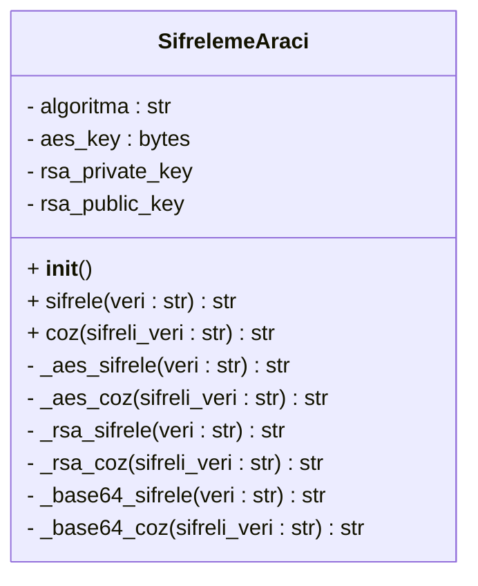

## FAZ-0 UML Diagram

```mermaid
classDiagram

class SifrelemeAraci {

    - algoritma : str
    - aes_key : bytes
    - rsa_private_key
    - rsa_public_key

    + __init__()
    + sifrele(veri : str) str
    + coz(sifreli_veri : str) str

    - _aes_sifrele(veri : str) str
    - _aes_coz(sifreli_veri : str) str

    - _rsa_sifrele(veri : str) str
    - _rsa_coz(sifreli_veri : str) str

    - _base64_sifrele(veri : str) str
    - _base64_coz(sifreli_veri : str) str
}
```