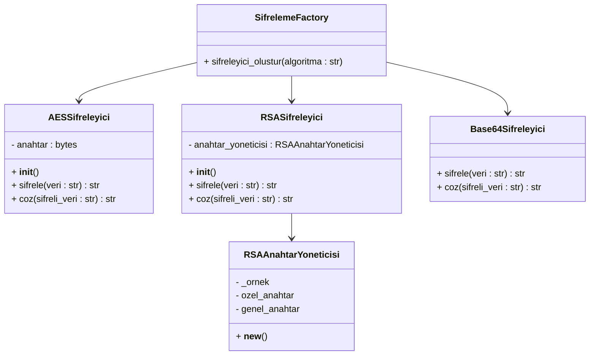

## FAZ-1 UML Diagram

```mermaid
classDiagram

class SifrelemeFactory {

    + sifreleyici_olustur(algoritma : str)
}

class AESSifreleyici {

    - anahtar : bytes

    + __init__()
    + sifrele(veri : str) str
    + coz(sifreli_veri : str) str
}

class RSASifreleyici {

    - anahtar_yoneticisi : RSAAnahtarYoneticisi

    + __init__()
    + sifrele(veri : str) str
    + coz(sifreli_veri : str) str
}

class Base64Sifreleyici {

    + sifrele(veri : str) str
    + coz(sifreli_veri : str) str
}

class RSAAnahtarYoneticisi {

    - _ornek
    - ozel_anahtar
    - genel_anahtar

    + __new__()
}

SifrelemeFactory --> AESSifreleyici
SifrelemeFactory --> RSASifreleyici
SifrelemeFactory --> Base64Sifreleyici

RSASifreleyici --> RSAAnahtarYoneticisi
```
