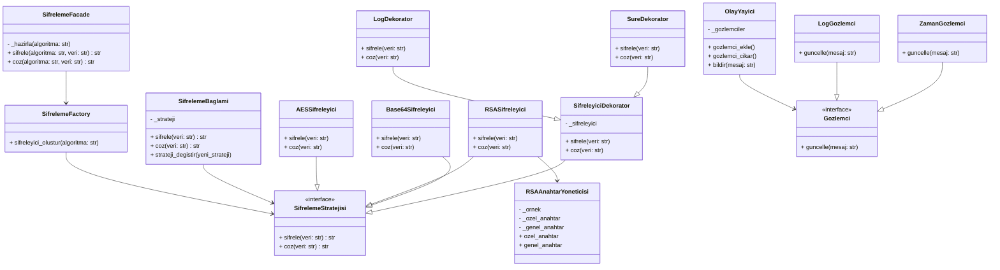

## FAZ-3 UML Diagram

```mermaid
classDiagram

%% =======================
%% FACTORY
%% =======================
class SifrelemeFactory {
    + sifreleyici_olustur(algoritma: str)
}

%% =======================
%% FACADE
%% =======================
class SifrelemeFacade {
    - _hazirla(algoritma: str)
    + sifrele(algoritma: str, veri: str) str
    + coz(algoritma: str, veri: str) str
}

%% =======================
%% STRATEGY
%% =======================
class SifrelemeStratejisi {
    <<interface>>
    + sifrele(veri: str) str
    + coz(veri: str) str
}

class SifrelemeBaglami {
    - _strateji
    + sifrele(veri: str) str
    + coz(veri: str) str
    + strateji_degistir(yeni_strateji)
}

%% =======================
%% CONCRETE STRATEGIES
%% =======================
class AESSifreleyici {
    + sifrele(veri: str)
    + coz(veri: str)
}

class RSASifreleyici {
    + sifrele(veri: str)
    + coz(veri: str)
}

class Base64Sifreleyici {
    + sifrele(veri: str)
    + coz(veri: str)
}

%% =======================
%% SINGLETON
%% =======================
class RSAAnahtarYoneticisi {
    - _ornek
    - _ozel_anahtar
    - _genel_anahtar
    + ozel_anahtar
    + genel_anahtar
}

%% =======================
%% DECORATOR
%% =======================
class SifreleyiciDekorator {
    - _sifreleyici
    + sifrele(veri: str)
    + coz(veri: str)
}

class LogDekorator {
    + sifrele(veri: str)
    + coz(veri: str)
}

class SureDekorator {
    + sifrele(veri: str)
    + coz(veri: str)
}

%% =======================
%% OBSERVER
%% =======================
class Gozlemci {
    <<interface>>
    + guncelle(mesaj: str)
}

class LogGozlemci {
    + guncelle(mesaj: str)
}

class ZamanGozlemci {
    + guncelle(mesaj: str)
}

class OlayYayici {
    - _gozlemciler
    + gozlemci_ekle()
    + gozlemci_cikar()
    + bildir(mesaj: str)
}

%% =======================
%% RELATIONS
%% =======================

SifrelemeFactory --> SifrelemeStratejisi

SifrelemeFacade --> SifrelemeFactory

SifrelemeBaglami --> SifrelemeStratejisi

AESSifreleyici --|> SifrelemeStratejisi
RSASifreleyici --|> SifrelemeStratejisi
Base64Sifreleyici --|> SifrelemeStratejisi

RSASifreleyici --> RSAAnahtarYoneticisi

SifreleyiciDekorator --|> SifrelemeStratejisi
LogDekorator --|> SifreleyiciDekorator
SureDekorator --|> SifreleyiciDekorator

OlayYayici --> Gozlemci
LogGozlemci --|> Gozlemci
ZamanGozlemci --|> Gozlemci
```